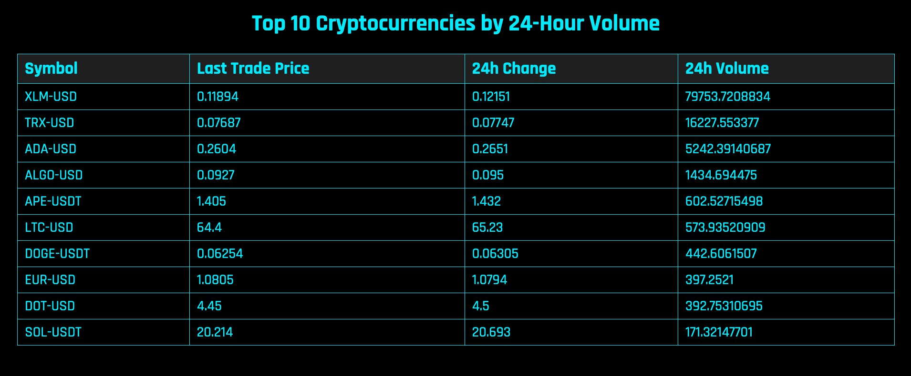

# Blockchain-API-Site

**Blockchain-API-Site** is a sleek, modern web application built using Node.js, Express.js, and EJS to display the top 10 cryptocurrencies by 24-hour volume. This application ensures a futuristic design and is responsive for a variety of devices.

## Features

- Fetches and displays the top 10 cryptocurrencies by 24-hour volume.
- Data is sourced from the Blockchain.com API.
- A futuristic and modern design that's both appealing and easy to read.
- Responsive design ensures usability across a spectrum of devices.

## Implementation

**Blockchain-API-Site** is implemented using the following technologies:

- Node.js and Express.js for server-side logic.
- EJS for dynamic HTML rendering on the server.
- CSS for styling, focusing on a futuristic aesthetic.
- Fetch API for gathering cryptocurrency data.

## Installation and Usage

1. Clone the repository: `git clone https://github.com/EMerchant90/Blockchain-API-Site.git`
2. Navigate to the project directory: `cd Blockchain-API-Site`
3. Install the dependencies: `npm install`
4. Start the server: `npm start`
5. Open your web browser and navigate to `http://localhost:3000`
